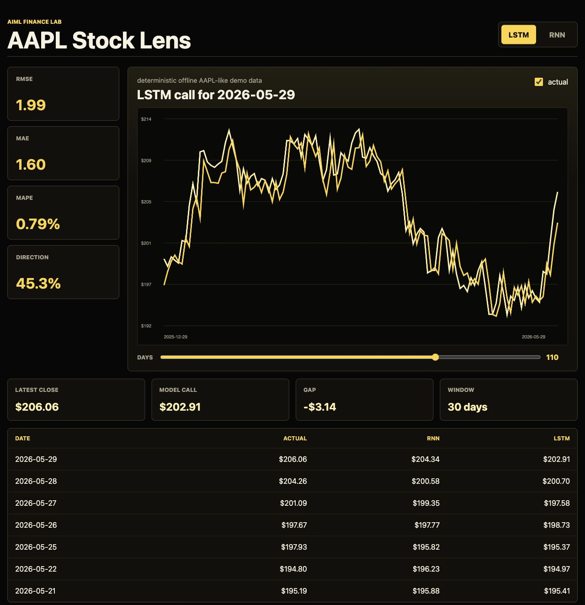

# Machine-Learning

Machine learning project collection with runnable code, tests, screenshots, and captured outputs.

## Projects

### 1. Stock Price Prediction using LSTM and RNN

Apple stock prediction using time-series windows, RSI, EMA, RNN, and LSTM-style models.

- Code: `stock_lens/`
- Output screenshots: `outputs/`
- Run:

```bash
python -m stock_lens.cli run --symbol AAPL --demo-data --output outputs
python -m stock_lens.cli serve --port 8765
```



### 2. Deep Learning for Computer Vision using Python and MATLAB

Computer vision project using Python for the working model and MATLAB files for the equivalent deep learning workflow.

- Code: `computer_vision_cyberlab/`
- Output screenshots: `computer_vision_cyberlab/outputs/`
- Run:

```bash
cd computer_vision_cyberlab
python -m vision_cyberlab.cli run --output outputs
python -m vision_cyberlab.cli serve --port 8790
```


### 3. Billing & Subscription Renewal Management System

Flask based billing and renewal management app with customer records, invoices, payment tracking, dashboard analytics, and prediction workflows.

- Code: `billing-renewal-system/`
- Screenshot folder: `billing-renewal-system/screenshots/`
- Run:

```bash
cd billing-renewal-system
python -m venv venv
source venv/bin/activate
pip install -r requirements.txt
python app.py
```

### 4. Health Risk Predictor

Health profile classifier using Random Forest with generated tabular health signals.

- Code: `health_risk_predictor/`
- Screenshot: `health_risk_predictor/screenshots/dashboard.png`
- Run:

```bash
cd health_risk_predictor
pip install -r requirements.txt
python main.py
pytest tests
```

### 5. Smart House Price Estimator

Regression project for estimating house prices from area, rooms, property age, and location features.

- Code: `smart_house_price_estimator/`
- Screenshot: `smart_house_price_estimator/screenshots/dashboard.png`
- Run:

```bash
cd smart_house_price_estimator
pip install -r requirements.txt
python main.py
pytest tests
```

### 6. Movie Review Sentiment

Text classification project using TF-IDF features and Logistic Regression for review sentiment.

- Code: `movie_review_sentiment/`
- Screenshot: `movie_review_sentiment/screenshots/dashboard.png`
- Run:

```bash
cd movie_review_sentiment
pip install -r requirements.txt
python main.py
pytest tests
```

### 7. Customer Segmentation Lab

K-Means clustering project that groups customers by spending, visits, income score, and loyalty score.

- Code: `customer_segmentation_lab/`
- Screenshot: `customer_segmentation_lab/screenshots/dashboard.png`
- Run:

```bash
cd customer_segmentation_lab
pip install -r requirements.txt
python main.py
pytest tests
```

### 8. Loan Approval Classifier

Loan approval prediction workflow using applicant income, credit score, loan amount, and debt profile.

- Code: `loan_approval_classifier/`
- Screenshot: `loan_approval_classifier/screenshots/dashboard.png`
- Run:

```bash
cd loan_approval_classifier
pip install -r requirements.txt
python main.py
pytest tests
```

### 9. Crop Recommendation Engine

Multi-class crop recommendation project using soil nutrient and weather-style features.

- Code: `crop_recommendation_engine/`
- Screenshot: `crop_recommendation_engine/screenshots/dashboard.png`
- Run:

```bash
cd crop_recommendation_engine
pip install -r requirements.txt
python main.py
pytest tests
```

### 10. Resume Skill Matcher

NLP matching project that ranks resumes against job roles using TF-IDF similarity.

- Code: `resume_skill_matcher/`
- Screenshot: `resume_skill_matcher/screenshots/dashboard.png`
- Run:

```bash
cd resume_skill_matcher
pip install -r requirements.txt
python main.py
pytest tests
```

### 11. Retail Sales Forecaster

Forecasting project for monthly retail sales using trend and seasonal features.

- Code: `retail_sales_forecaster/`
- Screenshot: `retail_sales_forecaster/screenshots/dashboard.png`
- Run:

```bash
cd retail_sales_forecaster
pip install -r requirements.txt
python main.py
pytest tests
```

### 12. Digit Recognition SVM

Handwritten digit classifier using the scikit-learn digits dataset and an SVM pipeline.

- Code: `digit_recognition_svm/`
- Screenshot: `digit_recognition_svm/screenshots/dashboard.png`
- Run:

```bash
cd digit_recognition_svm
pip install -r requirements.txt
python main.py
pytest tests
```

### 13. Traffic Volume Predictor

Regression project that estimates traffic volume from hour, weekday, weather, and event signals.

- Code: `traffic_volume_predictor/`
- Screenshot: `traffic_volume_predictor/screenshots/dashboard.png`
- Run:

```bash
cd traffic_volume_predictor
pip install -r requirements.txt
python main.py
pytest tests
```

### 14. 100 Python Machine Learning Mini Projects

A structured collection of compact machine learning projects covering classification, regression, clustering, forecasting, NLP matching, anomaly detection, and recommendation workflows.

- Code: `portfolio_100_ml_projects/`
- Index: `portfolio_100_ml_projects/README.md`
- Each project includes code, README, test, metrics output, chart screenshot, and HTML preview.
- Run one project:

```bash
cd portfolio_100_ml_projects/001_student_performance_classification
python main.py
pytest tests
```

### 15. Next 100 Python Machine Learning Mini Projects

A second structured collection of compact Python ML projects numbered 101-200, with fresh topics across student, healthcare, finance, retail, transport, NLP, and systems use cases.

- Code: `portfolio_next_100_ml_projects/`
- Index: `portfolio_next_100_ml_projects/README.md`
- Each project includes code, README, test, metrics output, chart screenshot, and HTML preview.
- Run one project:

```bash
cd portfolio_next_100_ml_projects/101_mental_health_check_classification
python main.py
pytest tests
```
