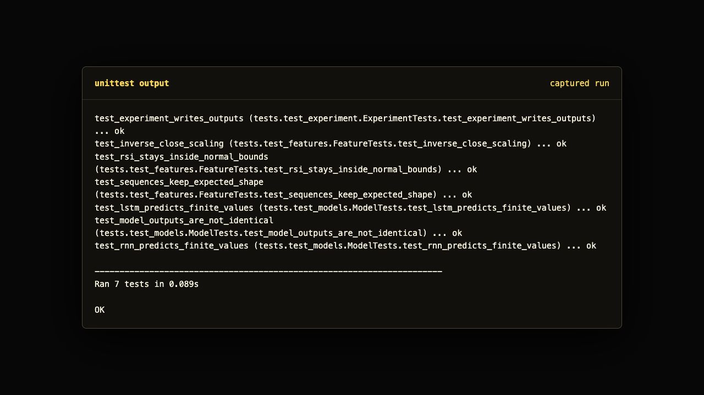

# Stock Price Prediction using LSTM and RNN

This is my AIML finance mini project where I tried to predict Apple stock price movement using RNN and LSTM style models. I am 21, doing enginerring in AIML, so I wanted this repo to feel like an actual student build and not some dry copied tutorial.

The main idea is simple: take AAPL historical price data, clean it, add useful indicators like RSI and EMA, convert the data into time windows, then compare a simple RNN model with an LSTM model. The UI is made in a black, white and yellowish minimal style because I wanted it to look sharp and little commanding.

## What is inside

- AAPL stock data loader with Yahoo Finance support and a deterministic demo fallback
- RSI, EMA, returns and volume based feature engineering
- sequence maker for time series windows
- RNN and LSTM predictors in NumPy for native quick running
- Keras/TensorFlow model builders also included for full deep learning setup
- interactive dashboard made with HTML, CSS, JS and Python server
- tests for preprocessing, models and output generation
- captured output files and screenshots inside `outputs/`

## Screenshots




## Run it

I tested the native demo like this:

```bash
python -m stock_lens.cli run --symbol AAPL --demo-data --output outputs
python -m stock_lens.cli serve --port 8765 --output outputs
```

Open:

```text
http://127.0.0.1:8765
```

For tests:

```bash
python -m unittest discover -v
```

## Full Yahoo/TensorFlow setup

The native demo works without installing a big ML stack. For the full version with Yahoo Finance and TensorFlow/Keras:

```bash
python -m pip install -r requirements.txt
python -m stock_lens.cli run --symbol AAPL --yahoo --output outputs
```

The code first tries Yahoo Finance when `--yahoo` is used. If the package or network is not ready, the project still runs with the built-in AAPL-like dataset so the whole thing does not break like a weak project.

## My notes

This is not financial advice and I am not pretending this can beat the market. Stock market is noisy and sometimes brutal. This is mainly to show time-series preprocessing, RNN/LSTM thinking, clean testing and a usable UI in one repo.

I kept the README a bit in my own tone because portfolio projects shpuld not look like generated corporate documents every time.
