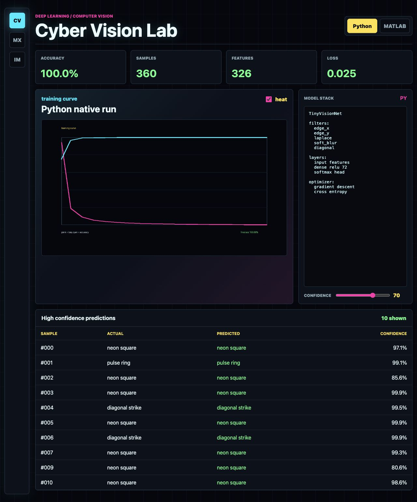
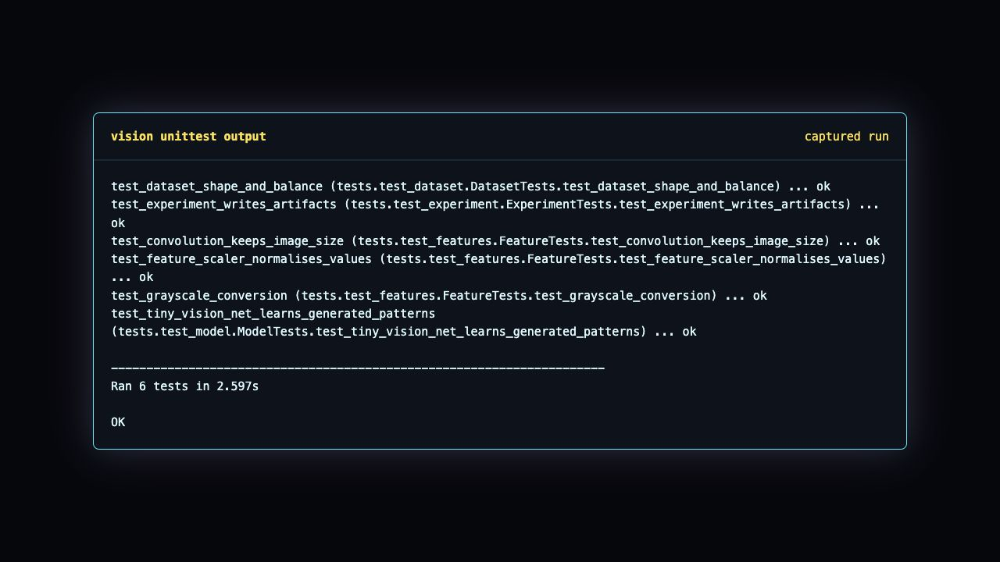

# Deep Learning for Computer Vision using Python and MATLAB

This is my computer vision deep learning mini project. I wanted it to look different from normal college projects, so the UI is cyberpunk themed and the code is kept readable like something I can explain in viva without freezing.

The project trains a tiny neural network to classify synthetic vision samples. The images are generated with noisy neon patterns, then Python extracts convolution style filter-bank features and trains a small ReLU + Softmax network. I also added MATLAB scripts showing how the same idea can be done using image datastores and CNN layers.

## Idea

Computer vision models learn from image patterns like edges, shapes, colors and texture. CNNs are powerful because convolution layers scan the image with filters instead of treating every pixel like a separate random number. This project keeps that concept simple:

- generate small image samples for three classes
- pass each image through edge and texture filters
- pool the responses into compact features
- train a tiny deep learning classifier
- show accuracy, confusion matrix, training curve and sample predictions in a cyberpunk UI

## Classes

- `neon_square`
- `pulse_ring`
- `diagonal_strike`

## Files

- `vision_cyberlab/` - Python source code
- `matlab/` - MATLAB reference implementation
- `tests/` - unit tests
- `outputs/` - captured run output and screenshots

## Screenshots





## Run

```bash
python -m vision_cyberlab.cli run --output outputs
python -m vision_cyberlab.cli serve --port 8790
```

Open:

```text
http://127.0.0.1:8790
```

Tests:

```bash
python -m unittest discover -v
```

## MATLAB part

Open `matlab/cyberVisionDemo.m` in MATLAB. It shows the same pipeline in MATLAB style:

- image datastore
- CNN layers
- training options
- prediction
- confusion chart

I did not make MATLAB mandatory for the native run because not every system has MATLAB installed. The Python project runs fully here and the MATLAB part is kept as the reference side.

## Final note

This is a learning project, not some production level vision AI. But it is complete enough to show dataset generation, feature extraction, neural network training, testing, outputs and UI. Basically one proper computer vision project, not just theory screenshots.
