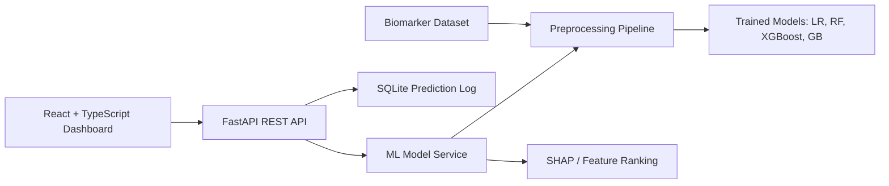

# Predictive Modeling of Obesity Prevalence from Ocular and Metabolic Biomarkers

An academic AI/ML mini-project that predicts obesity risk levels by combining ocular biomarkers with metabolic indicators. The project is built as a practical healthcare analytics system: a FastAPI backend, a Scikit-Learn/XGBoost training pipeline, a SQLite prediction log, and a React TypeScript dashboard for faculty demonstration.

## Abstract

Obesity is a major public health concern linked with metabolic disorders, cardiovascular risk, and eye-health changes. This project explores whether ocular biomarkers such as retinal vessel measurements, intraocular pressure, visual acuity, and macular thickness can improve obesity risk prediction when combined with metabolic biomarkers including BMI, glucose, cholesterol, triglycerides, blood pressure, age, waist circumference, and insulin resistance indicators.

The system trains multiple supervised machine learning models and exposes the best model through a clinical-style web dashboard. It also provides feature rankings and SHAP-based explainability so the prediction is easier to interpret in an academic review.

## Problem Statement

Traditional obesity screening often depends mainly on BMI and waist circumference. This project studies a broader multimodal biomarker view by adding ocular measurements that may reflect vascular and metabolic health. The goal is to predict obesity risk categories and help faculty understand which biomarkers influence the model most.

## Objectives

- Build a complete AI-powered healthcare prediction system.
- Process biomarker data with missing value handling, outlier treatment, feature scaling, and feature engineering.
- Train and compare Logistic Regression, Random Forest, XGBoost, and Gradient Boosting models.
- Evaluate models using Accuracy, Precision, Recall, F1 Score, and ROC AUC.
- Add explainability through SHAP feature importance and biomarker ranking.
- Create a professional React dashboard suitable for university demonstration.
- Persist prediction history in SQLite.
- Package the application with Docker support.

## Methodology

1. Generate or load a biomarker dataset with ocular and metabolic measurements.
2. Apply preprocessing:
   - median imputation for numeric biomarkers,
   - most-frequent imputation for categorical features,
   - IQR-based outlier clipping,
   - feature scaling,
   - engineered clinical ratios and risk indicators.
3. Train four supervised classifiers.
4. Select the best model using weighted F1 and ROC AUC.
5. Save model artifacts with Joblib.
6. Serve predictions through FastAPI.
7. Visualize results with React and Recharts.

## Dataset

The repository includes a synthetic academic demonstration dataset generated from clinically plausible ranges. It is not a medical-grade dataset and must not be used for real diagnosis. The generator is included so the learning process is transparent and reproducible.

Main biomarker groups:

- Metabolic: BMI, waist circumference, fasting glucose, HbA1c, cholesterol, triglycerides, HDL, LDL, systolic/diastolic blood pressure, insulin resistance index.
- Ocular: retinal arteriole and venule diameter, arteriole-venule ratio, intraocular pressure, visual acuity score, macular thickness, cup-disc ratio, ocular risk score.
- Demographic: age and gender.

## Model Selection

The project trains:

- Logistic Regression as a baseline interpretable model.
- Random Forest for non-linear biomarker interactions.
- XGBoost for boosted-tree performance.
- Gradient Boosting as a strong classical ensemble model.

The backend chooses the best model by weighted F1 score, with ROC AUC as a secondary indicator.

## Results

Results are generated by running:

```bash
cd backend
python -m app.ml.training
```

The training script writes model metrics and feature rankings to `backend/artifacts/`. The dashboard reads the same artifacts through API endpoints.

## Project Architecture



## Repository Structure

```text
obesity-ocular-metabolic-prediction/
├── backend/
│   ├── app/
│   │   ├── api/
│   │   ├── core/
│   │   ├── db/
│   │   ├── ml/
│   │   ├── models/
│   │   └── services/
│   └── tests/
├── frontend/
│   └── src/
├── data/
├── docs/
├── reports/
├── screenshots/
├── scripts/
├── docker-compose.yml
└── README.md
```

## Running Locally

### Backend

```bash
cd obesity-ocular-metabolic-prediction/backend
python -m venv .venv
source .venv/bin/activate
pip install -r requirements.txt
python -m app.ml.training
uvicorn app.main:app --reload --port 8000
```

### Frontend

```bash
cd obesity-ocular-metabolic-prediction/frontend
npm install
npm run dev
```

Open `http://localhost:5173`.

## Docker

```bash
cd obesity-ocular-metabolic-prediction
docker compose up --build
```

Frontend: `http://localhost:5173`  
Backend API: `http://localhost:8000`

## API Endpoints

- `GET /health`
- `GET /api/dashboard`
- `POST /api/predict`
- `GET /api/analytics`
- `GET /api/models`
- `GET /api/insights`

## Future Work

- Replace the synthetic dataset with a real clinical or research dataset after ethics approval.
- Add retinal image feature extraction using computer vision.
- Compare deep learning image embeddings with hand-engineered ocular biomarkers.
- Add calibration curves and fairness checks across age and gender groups.
- Improve SHAP explanations with per-patient visual force plots.

## Academic Note

This project is for learning and university evaluation only. It is not a certified clinical decision support tool and must not be used for medical diagnosis.
