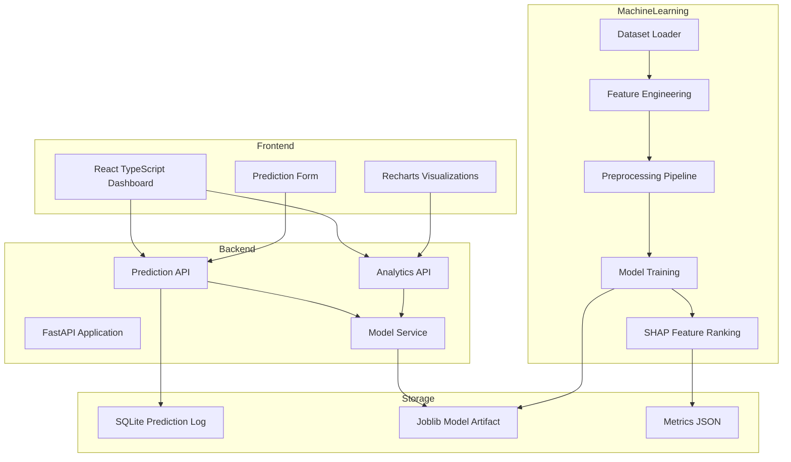

# Architecture

## System Overview

## Backend Components

- `app/main.py`: FastAPI app factory, CORS configuration, startup initialization.
- `app/api/routes.py`: REST endpoints for dashboard, prediction, analytics, models, and insights.
- `app/ml/dataset.py`: synthetic dataset generation and loading.
- `app/ml/preprocessing.py`: feature engineering, imputation, outlier clipping, scaling, and encoding.
- `app/ml/training.py`: model training, evaluation, model selection, and artifact persistence.
- `app/ml/explainability.py`: SHAP feature ranking with fallback support.
- `app/db/database.py`: SQLite prediction storage.

## Frontend Components

- Dashboard page for total records, BMI, model accuracy, and risk distribution.
- Prediction page for patient biomarker input and risk output.
- Analytics page for feature importance, correlations, and distributions.
- Model comparison page for evaluation metrics.
- Research insights page for findings and dataset statistics.

## Database Design

The SQLite database stores live prediction history:

| Column | Purpose |
| --- | --- |
| `created_at` | UTC prediction time |
| `risk_category` | Low, Moderate, or High |
| `obesity_risk_percentage` | Probability of high-risk obesity category |
| `confidence_score` | Maximum model probability |
| `model_used` | Selected trained model |
| `request_json` | Raw biomarker input |
| `probabilities_json` | Class probability output |

## Deployment

Docker Compose starts both services:

- Backend: FastAPI on port `8000`.
- Frontend: Vite React app on port `5173`.
